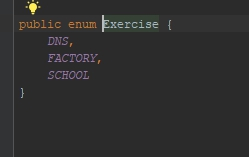
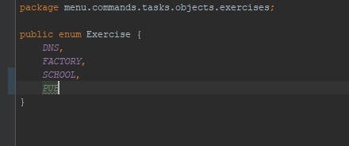

1. [Коротко о pull request](#pull-request)
1. [Как делать Rebase?](#rebase)
1. [Что делать если возник merge conflict?](#Что-такое-merge-conflict)
1. [Как сделать сложный merge?](#Как-сделать-сложный-merge)
1. [Новая структура проекта](#Новая-структура)

## Как начать работу?

Склонировать репозиторий себе на пк:

Для этого сначала нужно взять ссылку с репозитория

Затем скопировать скопировать ее в ide в окно VCS => Checkout from Version Control => git

Выполнять работу нужно на своей ветке. 

## Как создать свою ветку? 

## Первый шаг

## Второй шаг

## Третий шаг
Имя бренча формируется из:

Имя исполнителя - выполняемое задание

Пример:

`ivan-menu.commands.tasks.objects`

## Четвертый шаг

## Пятый шаг

На своей ветке можете писать код и делать любое колличество коммитов.
[Как работать с веткой (бернчом)?](#Как-работать-с-веткой)

## Шестой шаг

## Седьмой шаг
Решив что-то закоммитить, опиши что именно ты сделал, в краткой но понятной форме

## Восьмой шаг
После добавления описания можно закоммитить все что ты написал на свой пк (commit) или залить закоммитить локально а затем залить
изменения на сервер (commit and push)

## Девятый шаг

## Десятый шаг
Если все прошло успешно то в IDE появится оповещение об этом, если push по каким то причинам не удался
то гит тебя об этом оповестит так же.

## Одинадцатый шаг
После всех проделаннх действий твою ветку можно будет увидеть на git

# Как работать с веткой?
Написаннй тобой код хранится в системе контроля версий которая сопоставляет твои измениня с кодом который хранится
на серверах git. После checkout и первого push твой код хранится в двух местах:

- У тебя на компьютере

- На сервере

После одобрения pull request и мерджа в мастер свою ветку можно удалить, чтобы она не захламляла место. 

Удалить можно через git нажав на кнопку корзины:

Или через интерфейс IDE:

После удаления в IDE она спросит тебя нужно ли удалить ветку на сервере, **будь предельно внимателен на этом моменте 
иногда по невнимательности есть опасность удалить нужную ветку с сервера**

При выборе пункта `restore` ветка будет востановлена.
 
# Pull request

**Перед создание pull request необходимо сделать [rebase](#rebase) на мастер!**

PULL REQUEST - это запрос на перенос данных с твоей ветки на основуню ветку разработки - master

**Напрямую в `master` коммитить запрещено! все измения должны проходить только через pull request!**  

Для отправки задания на проверку нужно будет сделать несколько действий:

После того как ты посчитаешь что задание выполнено нужно перейти на github, найти свою ветку и нажать на кнопку
`new pull request`

Откроется окно создания pull request. Нужно заполнить название pull request и сделать assign на меня, а так же выставить
label `done`. Можно выставлять и другие лейблы, например `help wanted` если в ходе выполнения задания или исправлнения
замечаний по pull request возникли сложности. 

Так же в описании желательно заполнить что именно было сделано.

## Rebase

Перед созданием pull request необходимо подтянуть измениня которые могли возникнуть в мастере после того как ты создал 
свою ветку. Для этого необходимо:

Перейти с твоей текущей ветки на ветку в которую ты хочешь сделать pull request (в нашем случае ветка `master`)

Обновить ветку до последней версии

Нажать Ok использовав параметры которые идея выставит по умолчанию.

Вернутся на ветку в которой ты писал код и с которой ты будешь отправлять pull request.

Находясь на этой ветке в меню гит выбрать пункт `rebase current onto selecte` у ветки в которую будет отправлен 
pull request (В нашем случае в `master`)

Изменение лучше отправлять с помощью **force push** Однако будь предельно внимателен! Force push удалит 
все изменения в твоей ветке на сервере и зальет на него твою текущую ветку с того пк на котором ты сейчас работаешь. 

**! Использовать Force push можно только на своей ветке и только при полной уверенности что на серевере 
нет кода которого нет на твоем текущем пк !**

## Что такое merge conflict?

Git отслеживает изменения во всех файлах построчно, и если он видит что в одном и том же файле, в одной и той же строчке
два разных пользователя сделали два разных изменения, то при попытки обновить ветку (например с помощью rebase) 
возникнит конфликт. Для его решения если изменеий много и самостоятельно ты в них разобраться не способен необходимо:

Вычислить автора изменений которые конфликтуют с твоим кодом. Для этого в Idea кликни правой клавишей мыши 
по любому номеру строкчки кода.

Поле этого возле каждой строчки кода появится имя пользователя который внес изменения в файл и время, когда он 
это сделал.

Дальше желательно связаться с ним и убедится что твои изменения не сломают логику автора. 

**! Удалять код другого пользователя без причины или согласования запрещено !**

Если конфликт не сложный можно добавть свой код самостоятельно не удаляя при этом код предидущего автора.

## Как сделать сложный merge?

Merge считается одной из самых сложных операций при работе с SVN в не зависимости от ее типа. В случае если 
на проекте произошло много изменений, его сложность многократно увеличивается. Перед тем как начать мердж
необходимо простмотреть все изменения в ветке в которую в будущем сделать слияние и пронять как это повлияет на 
то что ты уже сделал и как изменить свой текущий код чтобы он успешно работал на новой ветке. 

На примере больших изменений между локальной веткой и мастером.

- Открываем проект, убедившись что находимся на своей ветке которую нужно обновить до уровня текущего мастера

- Переходим на ветку изменения с которой нам нужно перенести в нашу. (В нашем случае `master`)

- Обновляем ветку с которой мы хоти подтянуть изменения до последней версии.

- Возвращаемся к своей ветке

`Если в проекте есть какие-либо незакоммиченные изменения то при пререходе от ветки к ветки идея будет показывать тебе
окно с проблемами checkout, в общем случае нужно нажимать smart checkout`

- Выбираем бренч с которого мы хотим подтянуть изменения (`master`), выбираем `rebase current onto selected`

`Если на целевой ветке и на той которую на которую ты хочешь сдалть rebase имееются изменения в одних и тех же файлах, 
появится окно conflicts: `

`Что именно выбрать, зависит от сепецифики изменений на векте. В данном случае мы видим что файл в котором были сделанны
 изменния на твоей ветке удален в мастере. Изменения в мастере всегад в приоритете, а значит и тебе необходимо 
 выбрать пункт ACCEPT THEIRS и понять как сделать так, чтобы твой код запускался. Для этого перед мерджом необходимо 
 для начала разобраться что именно произошло на проекте и как и куда нужно добавить код.`
 
 Посмотрев на структуру проекта мы видим что она серьезно изменилась: 
 
 

 Подробно на изменениях останавливаться не имеет смыла, но для программиста очень важно уметь самостоятельно разбираться
 с незнакомым кодом, по этом я настоятельно рекомендую перед rebase запустить проект несколько раз и попробовать
 самостоятельно понять что и как работает, и куда и что нужно добавить для окончательного выполнения задания.

 Если самому в том что происходит разобраься все такеи 
 не поулчеается то про новую структуру программы [читай здесь](#Новая-структура)
 
 Изучив структуру проекта м ыидим что задачи теперь находятся в папке tasks

 
 
 Так как выполняется задание Objects то необходимо пренести выполнение задания из старого метста в новое, дирикторию
 в которой лежало старое задание нужно удалить
 
 
 
 Видим что в нашем файле Pub идея увидила ошибка:
 
 
 
 Заходим в файл и пытаемся понять что с ним не так:
 
 
 
 Видим что проблема в неправильном импорте абстарктного класса. Удаляем старый импорт, ставим курсор на 
 название абстрактного класса Organization и нажимаем ctrl + enter (cmd + enter в Mac) выбираем подпункт import class.
 После этого ошибка исчезнет, но задание не будет показанно в меню консольного приложения и не может считаться выполненным.
 
 
 
 Для полного его выполнения необходимо добавить его в меню. Для этого смотрим как сделаны уже готовые задания.
 
 `Все структуры использованные в задании будут рассмотренны нами позже, сейчас на них останавливаться подробно не имеет смысла`
 
 Изучив как выводятся в консоль команды, находим класс ObjectTaskCommand в котором видим следующие записи:
 
 
 
 Делаем все по аналогии, добавляя новый пункт меню с выполнением задания.
 
 Сначала добавляем новый пункт меню путем копирования одно из ни и добавления названия нашего объекта:
 
 
 
 Видим что ниже есть конструкция switch case отвечающая за выбор задания и ExerciseFactory, отвечающая за создание
 конкретного объекта:
 
 
 
 Обращаем внимание что каждое задане имеет свой индекс в switch case и свое название в перечислении Exercise, зажимаем
 cmd\ctrl и кликаем на названии перечисления, после чего попадаем в него:
 
 
 
 Видим что для каждого задания имеется соответвующее ему название в enum, добавляем запис для нашего задания:
 
 
 
 Возвращаемся в класс ObjectTaskCommand и добавляем в switch case, case с идексом который мы указывали выше (4), 
 в него копируем тоже самые действия что проделаны в предидущем пункте, за исключением того что в аргументы метода 
 createOrganization мы отправлем Exercise.PUB:
 
 
 
 Переходим в ExerciseObjectFactory, и видим что в ней так же есть switch case в котором происходит создание объектов для
 заданий:
 
 
 
 Добавляем пункт для нашего задания:
 
 
 
 Запускаем приложение и проверяем:
 
 
 
 
 
 Задание успешно добавлено, можно делать commit + push в совю ветку и создавать pull request
 
 
 
 
 
 
## Новая-структура

Нам пора двигаться вперед, и структура нашего приложения изменилась. Приложение стало консольным, теперь выполнения заданий может
происхоить в любой момент по желанию пользователя. 

Как добавить выполнение задание?

Все актуальные и будущие просты задания будут храниться в впапке `menu => commands => tasks`

Здесь хранятся все задания по папкам с отдельным для каждого readme с указанием задания.

В каждой папке есть примр, выполнять задания нужно по аналогии с примером. Подробное добавление ответа на задание
на примере задания `objects` описанно выше.
