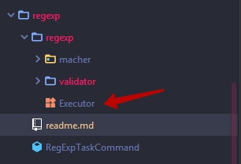

## RegExp

Задание разделено на две части:

1) [Validator](regexp/macher/readme.md)
1) [Matcher](regexp/validator/readme.md)

Задния необходимо выполнять последовательно. Подробное описание задания читай в конкретных папках.
Перед выполнением необходимо добавить исполнителя и его имя в виду строки в enum Executor.

## Полезные ссылки

1. [Удобный ресус по проверке RegExp](https://regexr.com/)
1. [Статья JavaRush про RegExp](https://javarush.ru/groups/posts/regulyarnye-vyrazheniya-v-java)