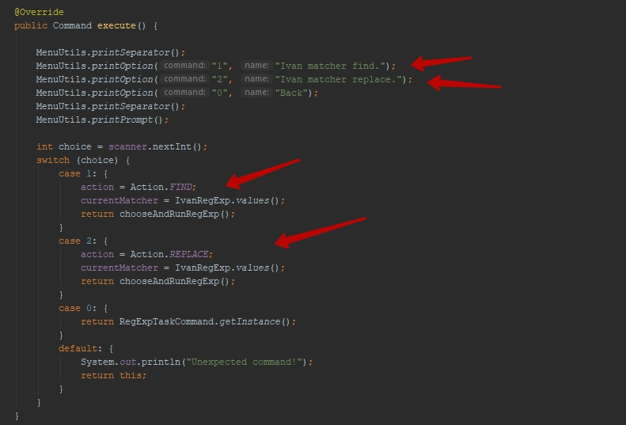

## [RegExp] Matcher

Перед выполнением задания внимательно изучи как работает данный пример.

Структура задания:

- Action - enum который содержит действия. `Find` для поиска и `Replace` для замены.
- RegExpMatcherRunner - Команда которая запускает поиск
- TextStore - хранилище текста в котором осущетсвляется поиск с помощью RegExp.

Выполнение задания каждый исполнитель должен осущетсвлять в созданной директории со своим именем.
В этой директории необходимо создать enum с реглярными выражениями для поиска:

- Чисел от 456 до 1200
- Слов начитанющихся на `L` и заканчивющихся на `m`
- Частей предложения начинающихся со знака `-` и закончивающихся `,` или `.`
- Традиционных дат в формате `day.month.year`, даты при этом должны быть валидными даты формата `99.99.9999` в выборку попадать не должны
- Невалидных дат, т.е. в выборку должны попасть только невалидные даты вроде `99.99.9999`
- Html теги которые присутствуют в тексе вместе с содержащимся в них текстом, в выборку должна попадать только
закрытые теги:

Пример:

- `
 Это div 
` - это валидный тэг он должен быть найден
- ` Это span` - это не валидный тэг, он должен быть проигнорирован, 

Каждому исполниетлю для выполнения задания необходимо добавить две команды для выполнения и замены данных,
как это сделанно в примере.
 

Осноная задача упражения - изучить как работать с regexp в языке Java.
