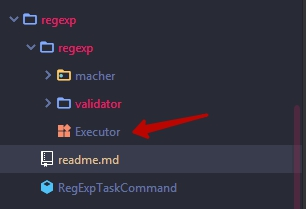
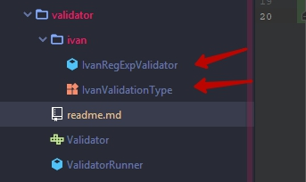
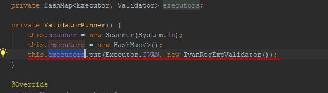

## [RegExp] Validator

Необходимо реализовать класс способный принимать аргумент типа стринг и проверять его на соответствие заранее 
заготовленному регулярному выражению.

Что необходимо сделать:

- Создать директорию с именем исполнителя 

- В этой директории создать class и enum в формате: {ExecutorName}RegExpValidator и {ExecutorName}ValidationType.

Пример:

`IvanRegExpValidator` - должен содержать методы которые используя принимаемое регулярное выражение будет
вычислятье его истиннисть.

`IvanValidationType ` - enum который должен содерать типы валидации и соответствующие ему регулярные выражения.

В папке Ivan предствлено упращенное исполнение задания, дальнейшее будет необходимо реализовать самостоятельно.

- Для того чтобы можно было запустить приложение, необходимо добавить экземпляр созданного класса в 
ValidationRunner в HashMap executors, как это сделанно в примере.

Осноная задача упражения - изучить как работать с regexp в языке Java.
