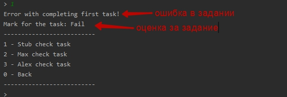
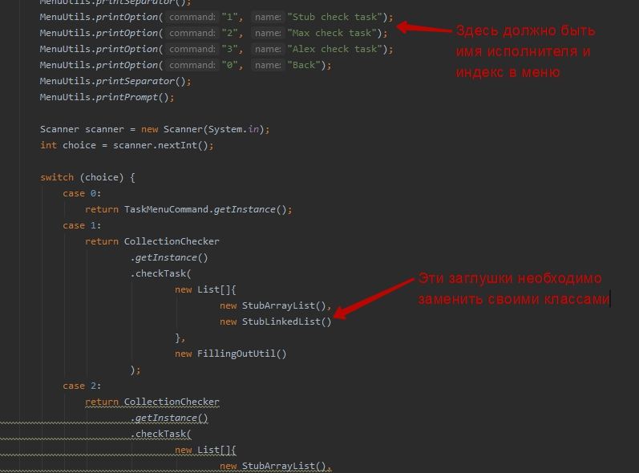

## Collection framework
В этой задаче нжно релаизовать свои версии самых простых структур данных и базовых 
алгоритмов сортировки. Общая задача разбита на 5 этапов, каждый этап дает + 1 балл к итоговй
оценке. Выполнение задания проверяется автоматически. Выполнения задания
должно проходить только в отдельный проименованных пакетах с именами исполнителя.

Проверить правильность выполнение можно самостоятельно запустив программу: 

## Подготовка

Перед выполнением задания необходимо подготовить все к его выполнению.
директории в которых нужно выполнять задания:

- Этап 1, 5 - в директории arraylist
- Этап 2 - в директории iterator
- Этап 3 - в директории fillingoututil
- Этап 4 - в директории linked list

Задачи распределены по сложности выполнять их нужно последовательно от меньшей
к большей.

После решения выполнить задание в той директории к которой относится задача
необходимо создать свою директорию в формате `имяисполнителязадание` 

### Пример: 
`ivanarraylist` в директории `arraylist`
`ivanlinkedlist` в директории `linkedlist`

всего на разных этапах нужно реализовать 4 класса в своих деректориях. Названия класса
должны быть формата `ИмяИсполнителяНазваниеСтруктуры`

### Пример: 
`IvanArrayList`
`IvanLinkedList` 

Так же исполнителю нужно убедтся что он внесен в интерфейс `CollectionTaskCommand`
и в случае если это не так, внести себя самостоятельно.

В каждой из директорий находится файл readme с описанием задания:

- [Первый этап](arraylist/readme.md)
- [Второй этап](iterator/readme.md)
- [Третий этап](fillingoututil/readme.md)
- [Четвертый этап](linkedlist/readme.md)
- [Пятый этап](arraylist/readme.md#пятый-этап)

!! После выполенения каждого задания необходимо отправлять его на промежуточное 
код ревью.